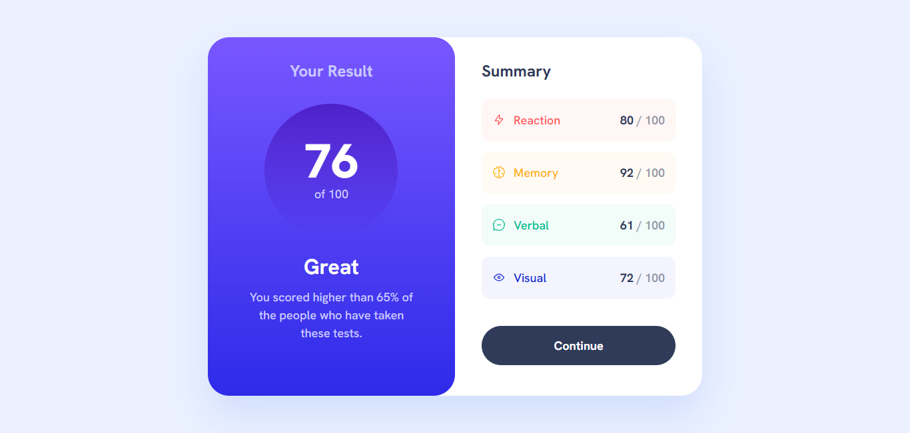

# Frontend Mentor - Results summary component solution

This is a solution to the [Results summary component challenge on Frontend Mentor](https://www.frontendmentor.io/challenges/results-summary-component-CE_K6s0maV). Frontend Mentor challenges help you improve your coding skills by building realistic projects.

## Table of contents

- [Overview](#overview)
  - [The challenge](#the-challenge)
  - [Screenshot](#screenshot)
  - [Links](#links)
- [My process](#my-process)
  - [Built with](#built-with)
  - [What I learned](#what-i-learned)
- [Author](#author)

## Overview

### The challenge

Users should be able to:

- View the optimal layout for the interface depending on their device's screen size
- See hover and focus states for all interactive elements on the page
- **Bonus**: Use the local JSON data to dynamically populate the content

### Screenshot

### Links

- Solution URL: [Frontend Mentor Solution](https://www.frontendmentor.io/solutions/results-summary-component-cuJSlaOHzt)
- Live Site URL: [Results Summary Component](https://melodious-sfogliatella-03f9a2.netlify.app/)

## My process

### Built with

- Semantic HTML5 markup
- CSS custom properties
- Flexbox
- CSS Grid
- [React](https://reactjs.org/) - JS library

### What I learned

This project was my first step into building with React, and it was a great learning experience moving from a static mindset to a component-based one.

- **Project Scaffolding with Vite:** Using `npm create vite@latest` was an incredibly fast way to set up a modern React project.

- **Component-Based Thinking:** I started by building the entire UI within a single `App` component. Refactoring the code into `ResultCard` and `Summary` components made the `App.jsx` file cleaner and the overall structure much easier to understand and maintain. This was a practical introduction to one of React's core principles.

- **Dynamic Rendering with Data:** Importing the `data.json` file directly into my component and using the `.map()` method to dynamically generate the summary list was a powerful feature. It demonstrated how easily React can turn data into UI elements, which was a key goal of this project.

## Author

- Frontend Mentor - [@gustavo2023](https://www.frontendmentor.io/profile/gustavo2023)
